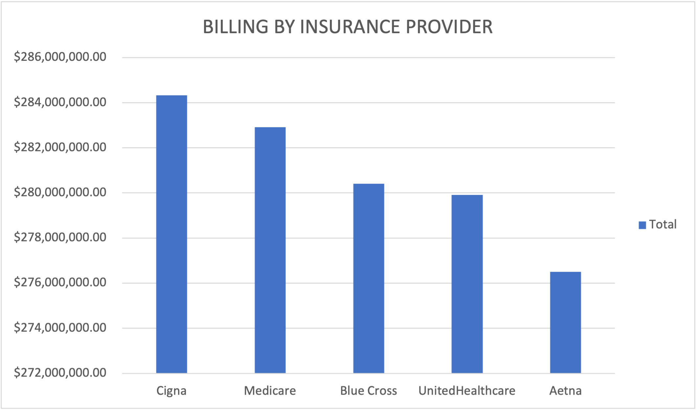
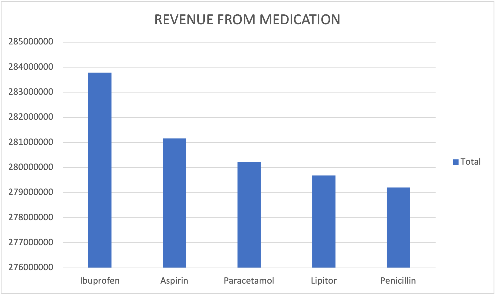

# Healthcare Data Analytics – Summary Report
**IOTB TECH Hospital | Dataset: 54,966 Patient Records**

## Pivot Table Analyses & Charts

---

### Patient Overview

 Total Patients = 54,966

 Male = 27,496 (50.0%) 

 Female = 27,470 (50.0%) 

 Most Common Blood Type = A- 

 Most Common Age Group = 65+ 

**Gender Distribution**

**Admissions by Age Group**

**Patients by Blood Group**

---

### Medical Condition Analysis

 Most Common Condition = Arthritis 

 Highest Billing Condition = Diabetes ($236.5M) 

 Longest Average Stay = Asthma (15.68 days) 

**Most Common Medical Conditions**

**Total Billing by Medical Condition**

### Revenue & Billing Analysis

 Total Hospital Revenue = $1,404,068,339 

 Top Insurance Provider = Cigna ($284.3M) 

 Highest Revenue Admission Type = Elective ($473.1M) 

**Monthly Revenue Trend**

**Billing by Insurance Provider**

**Revenue by Admission Type**

---

### Test Results Analysis

 Total Abnormal Results = 18,437 

 Condition with Most Abnormal Results = Arthritis (3,156) 

### Medication Analysis

 Most Prescribed Medication = Lipitor 

 Highest Billing Medication = Ibuprofen ($283.8M) 

**Most Prescribed Medications**

---

## Insights & Interpretation

1. **Even gender split.** Male and female patients are nearly equal (50/50), suggesting the hospital serves both demographics equally and no gender-targeted outreach is needed.

2. **Elderly patients dominate admissions.** The 65+ age group has the highest admissions, highlighting the hospital's heavy dependency on senior care. Investment in geriatric services is advisable.

3. **Arthritis is the most common condition**, yet Diabetes generates the highest total revenue ($236.5M). This means Diabetes patients incur higher individual costs despite not being the most frequent condition.

4. **Asthma patients stay the longest** (avg. 15.68 days), making them among the most resource-intensive patients in terms of bed occupancy and staff time.

5. **Revenue is relatively stable month-to-month** (avg. ~$23M/month), with a peak in August 2020. This indicates a steady business with seasonal spikes worth monitoring for staffing purposes.

6. **Cigna is the top insurance contributor** at $284.3M. Maintaining a strong relationship with Cigna is financially critical for the hospital.

7. **Elective admissions generate the most revenue** ($473.1M) and are also the most common admission type. Elective procedures are a key revenue driver and should be prioritized in scheduling.

8. **Female patients lead in emergency admissions** (9,166 vs 8,936 males). This warrants a review of emergency triage and women's health emergency preparedness.

9. **Arthritis leads in abnormal test results** (3,156 cases). This may reflect the chronic and progressive nature of the condition, requiring closer monitoring and diagnostic follow-up.

10. **Ibuprofen generates the highest billing revenue** ($283.8M) despite Lipitor being the most prescribed medication. This suggests Ibuprofen is prescribed at higher cost per dosage or for higher-billing patient groups.

---

### Recommendations

- **Expand geriatric and senior care services** to meet the demand from the dominant 65+ age group.
- **Invest in Diabetes management programs** as it is the top revenue-generating condition and likely has high readmission rates.
- **Review Asthma care pathways** to reduce the average 15.68-day stay, which ties up hospital beds.
- **Strengthen the Cigna partnership** and negotiate favorable terms given their $284M contribution.
- **Monitor emergency patterns for female patients** and ensure adequate emergency resources are allocated.
- **Audit abnormal test results** especially for Arthritis patients in order to improve early diagnosis and treatment protocols.

